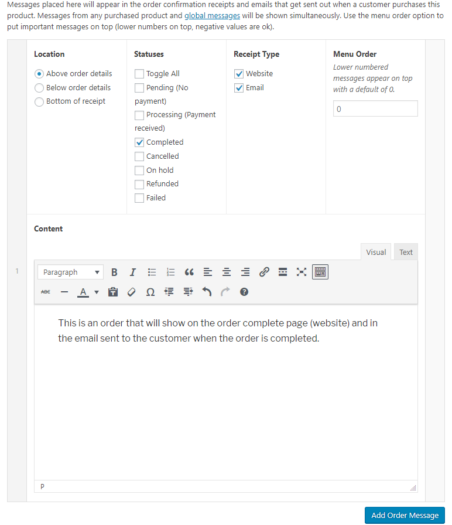
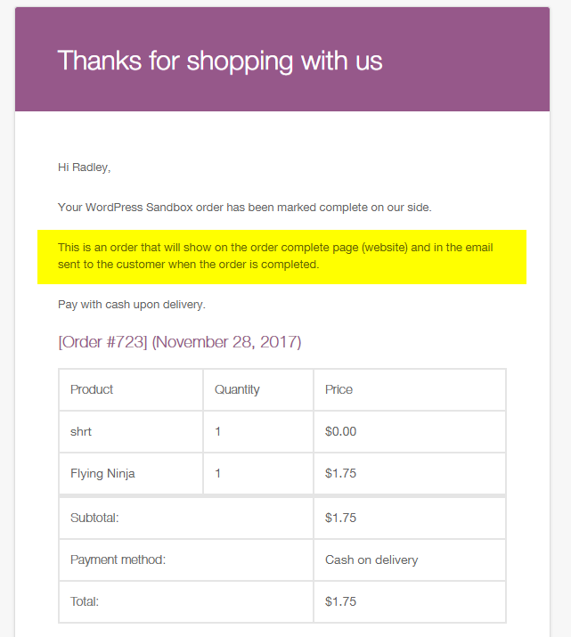

RS WooCommerce Order Messages
---

This plugin allows you to add one or more messages to your products which are displayed on the order email and thank you page.

Supports multiple products, and each product can have multiple messages. Messages can be set to display only for certain order statuses.

    Author: Radley Sustaire
    Author URI: https://radleysustaire.com/
    Contributors: radgh
    Donate link: https://paypal.me/radgh
    Tags: woocommerce, email
    Requires at least: 3.2
    Tested up to: 6.2
    Stable tag: 1.1.1
    License: GPLv3
    License URI: http://www.gnu.org/licenses/gpl-3.0.txt

## Installation ##

1. Upload the plugin files to `/wp-content/plugins/rs-woocommerce-order-messages/`, or install the plugin through the WordPress plugins screen.
2. Activate the plugin through the 'Plugins' screen in WordPress
3. Find global settings in WooCommerce > Order Messages or find per-product settings when editing a product under Product Order Messages
4. Add one or more messages.
5. View your message by viewing an order results page, or sending a customer email.

## Frequently Asked Questions ##

**What is Menu Order?**

The menu order is used when multiple messages are displayed in the same location. Lower numbers appear first, and negative numbers are allowed.

**Can multiple products use the same message without showing duplicate content?**

Yes! Since version 1.1.0, messages with duplicate content are only shown once per location.

## Screenshots ##





## Changelog ##

#### 1.2.0
* Added support for Git Updater, allowing this plugin to automatically receive updates

#### 1.1.1
* Removed unnecessary classes from message items (use parent container instead)
* HTML and trailing whitespace is now ignored when checking for duplicate messages
* Now sorts items before removing duplicates, which keeps high priority messages on top

#### 1.1.0
* Improved code style, naming conventions, and comments
* Removed inconsistent filters
* Replaced "AA" references with "RS"
* Added a new filter to modify messages before being displayed:
```
$messages = apply_filters( 'wom/messages', $messages, $order, $location, $type );
```

#### 1.0.1
* Fixed PHP warning when menu order was blank
* Set menu order default value to 0

#### 1.0
* First release

## Upgrade Notice ##

None yet.